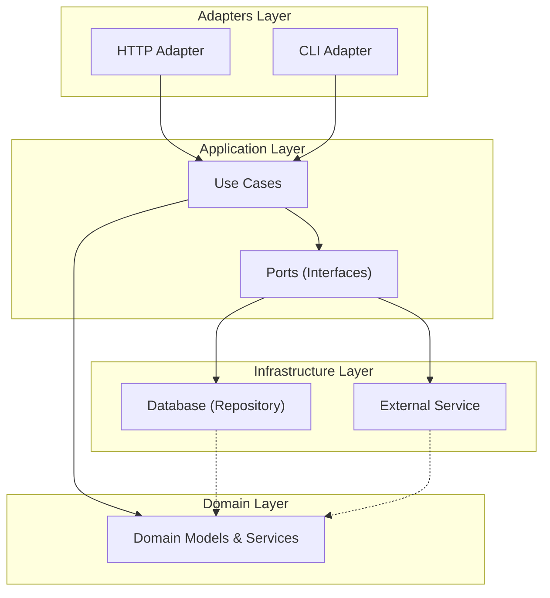

# DDD-Golang Todo Application

> **What is this project about?**
>
> This project is built using two powerful software design ideas: **Domain-Driven Design (DDD)** and **Hexagonal Architecture** (also called Ports & Adapters).
>
> - **Domain-Driven Design (DDD)** is about focusing your code on the real business or problem you want to solve. It means your code uses the same language and ideas as the people who know the business best.
> - **Hexagonal Architecture** is a way of organizing your code so that the "core" (the important business logic) is at the center, and all the ways of interacting with it (like web APIs, databases, or command-line tools) are kept at the edges. This makes your code easier to test, change, and grow.
>
> If you're new to these ideas, don't worry! This README will guide you step by step, explaining what each part does and why it matters.

## Overview

- [Build & Run](#build--run)
- [Project Structure](#project-structure)
- [Layer Responsibilities](#layer-responsibilities)
- [Use Case Explanation](#use-case-explanation)
- [Naming Conventions](#naming-conventions)
- [JSON Field Naming](#json-field-naming)
- [Error Handling](#error-handling)
- [Flow Example](#flow-example)
- [Testing](#testing)
- [DDD Principles Applied](#ddd-principles-applied)
- [How to Add a New Feature (with DDD Reasoning and Naming Context)](#how-to-add-a-new-feature-with-ddd-reasoning-and-naming-context)
- [Domain Service and Domain Model Explanation](#domain-service-and-domain-model-explanation)
- [Contributing](#contributing)

This project is a sample implementation of a Todo application using **Domain-Driven Design (DDD)** principles in Go. It demonstrates a clean architecture with clear separation of concerns, encapsulation, and best practices for structuring Go applications.

## Build & Run

### Docker Setup (Recommended)

**Build and start the application with PostgreSQL:**
```sh
make docker-build
make docker-up
```

**View logs:**
```sh
make docker-logs
```

**Stop the application:**
```sh
make docker-down
```

**Restart the application:**
```sh
make docker-restart
```

**Clean up Docker resources:**
```sh
make docker-clean
```

The application will be available at `http://localhost:8080` and PostgreSQL at `localhost:5432`.

### Available Makefile Operations

**Build the project binary:**
```sh
make build
```
The binary will be created at `build/bin/ddd-golang`.

**Run the application (using go run):**
```sh
make run
```

**Build and run the binary:**
```sh
make run-built
```

**Run tests:**
```sh
make test
```

**Run linting:**
```sh
make lint
```

**Generate Swagger documentation:**
```sh
make swagger
```

**Clean build artifacts:**
```sh
make clean
```

### Manual Commands

To run the application directly:
```sh
go run main.go
```

Or run the built binary directly:
```sh
./build/bin/ddd-golang
```

## Project Structure

```
ddd-golang/
  adapters/           # Adapters for CLI and HTTP (inbound interfaces)
    cli/              # CLI adapter
    http/             # HTTP adapter (REST API)
  application/        # Application layer (use cases, commands, queries, ports, models)
    command/          # Command objects for use cases
    model/            # Application models (response/request models, error responses)
    port/             # Port interfaces (inbound/outbound)
    query/            # Query objects for use cases
    usecase/          # Use case implementations
  domain/             # Domain layer (entities, value objects, domain services)
    event/            # Domain events
    model/            # Domain models (pure business logic)
    service/          # Domain services
  infrastructure/     # Infrastructure layer (repositories, DB, etc.)
    repository/       # In-memory repository implementation
  main.go             # Application entry point
  integration_test.go # Integration tests
  README.md           # This file
```

## Layer Responsibilities

- **Domain Layer**: Contains pure business logic, aggregates, value objects, and domain services. No dependencies on other layers.
- **Application Layer**: The application layer, orchestrating use cases and coordinating domain logic and infrastructure. See [Use Case Explanation](#use-case-explanation) for details.

  **The Application Layer: The Orchestrator of Your System**

  The application layer is like the "orchestrator" or "conductor" of your system. It tells the domain layer what to do, coordinates business processes, and connects your core logic to the outside world (like web APIs or databases). The application layer doesn't contain business rules itself—it just makes sure the right things happen in the right order.

  **Detailed Explanation:**
  The application layer is responsible for defining and executing the use cases of your system. A use case is a specific business action or process that the system must support (e.g., "Create Todo", "List Todos", "Complete Todo"). This layer acts as the "glue" between the domain layer (which contains pure business logic) and the outside world (adapters and infrastructure).

  **Key Responsibilities:**
  - **Orchestrate Use Cases:** Each use case is implemented as a function or method (often in a `UseCase` struct) that coordinates the steps required to fulfill a business process. This may involve validating input, invoking domain logic, and interacting with repositories or external services. See [Use Case Explanation](#use-case-explanation) for more details.
  - **Coordinate Domain Logic:** The application layer calls domain models and domain services to enforce business rules. It does not contain business rules itself, but ensures they are applied in the correct order and context.
  - **Coordinate Infrastructure:** When a use case requires data persistence or external communication, the application layer interacts with infrastructure through well-defined interfaces (ports). This allows the application logic to remain decoupled from technical details.
  - **Input/Output Mapping:** The application layer receives input (often as command/query objects) from adapters, processes it, and returns output (often as response models) back to adapters for presentation.

  **Why is this important?**
  - **Separation of Concerns:** By keeping orchestration and coordination in the application layer, you prevent business logic from leaking into adapters or infrastructure, and vice versa.
  - **Testability:** Use cases can be tested in isolation by mocking domain and infrastructure dependencies.
  - **Flexibility:** Changes to how a use case is orchestrated (e.g., adding validation, changing the order of operations) can be made without touching domain or infrastructure code.
  - **Decoupling:** The application layer depends only on interfaces (ports), not concrete implementations, making it easy to swap out infrastructure or change delivery mechanisms (e.g., from HTTP to CLI).

  **Example in this project:**
  - The `TodoUseCase` struct in `application/usecase/` implements methods like `CreateTodoUseCase`, `ListTodosUseCase`, etc.
  - These methods receive command/query objects, validate them (possibly using domain services), call domain models to perform business logic, and interact with repositories via port interfaces.
  - The results are returned as application models (response objects) to the adapters.

> **The Adapters Layer: The Translator Between Worlds**
>
> The adapters layer is like the "translator" or "gateway" for your application. It lets the outside world (like users, web browsers, or command-line tools) talk to your system. Adapters convert incoming requests into a form your application understands, and turn responses from your core logic back into something the outside world can use. This keeps your core logic clean and focused on business rules, not technical details.

- **Adapters Layer**: Implements inbound interfaces (HTTP, CLI) and handles request/response mapping.

> **The Infrastructure Layer: The Toolbox and Plumbing**
>
> The infrastructure layer is like the "toolbox" or "plumbing" of your application. It handles all the technical details—like saving data to a database, sending emails, or talking to other services—so your core logic doesn't have to worry about them. By keeping these details separate, you can easily swap out tools or technologies without changing your business rules.

- **Infrastructure Layer**: Implements outbound interfaces (repositories, DB, etc.).

## Naming Conventions

- **Port**: Interface for inbound/outbound communication (e.g., `TodoUseCasePort`, `TodoRepositoryPort`).
- **UseCase**: Application service implementing a use case (e.g., `TodoUseCase`).
- **Adapter**: Inbound adapter (e.g., `TodoHTTPAdapter`, `TodoCLIAdapter`).
- **Model**: Application-layer models for request/response and error responses (formerly DTOs).
- **DomainErrorPort**: Interface for domain errors with getter methods.

## JSON Field Naming

All JSON fields in API responses use **kebab-case** (e.g., `created-at`, `completed-at`, `error-message`).

## Error Handling

- All errors returned from use cases and adapters are domain errors implementing the `DomainErrorPort` interface.
- HTTP and CLI adapters map domain errors to structured error response models (see `application/model/error_response.go`).
- Errors are organized into logical groups with specific error code ranges:

### Error Code Ranges

- **1000-1999**: Validation errors (title, description, priority validation)
- **2000-2999**: Not found errors (todo not found)
- **3000-3999**: Operation errors (cannot complete/archive)
- **4000-4999**: Repository errors (database operations)
- **5000-5999**: HTTP errors (JSON parsing)
- **9000-9999**: Test errors (for testing purposes)

### Example Error Response

```json
{
  "error-code": 1001,
  "http-status": 400,
  "error-message": "Invalid title",
  "internal-reason": "Title validation failed",
  "details": {"max_length": "100"}
}
```

## Flow Example

1. **HTTP Request** → HTTP Adapter parses request and calls the use case via the port interface.
2. **Use Case** → Coordinates domain logic, calls domain models/services, and repositories.
3. **Domain Model** → Encapsulates business rules and validation.
4. **Repository** → Persists and retrieves domain models.
5. **Response** → Use case returns application model (response model) or domain error.
6. **HTTP Adapter** → Maps result to JSON response (kebab-case fields).

## Example: Create Todo (HTTP)

- **Request:**

```json
{
  "title": "Buy milk",
  "description": "Get 2 liters of milk",
  "priority": "high"
}
```

- **Response:**

```json
{
  "id": "..."
}
```

- **Error Response:**

```json
{
  "error-code": 1001,
  "http-status": 400,
  "error-message": "Invalid title",
  "internal-reason": "Title validation failed"
}
```

## Testing

- Run all tests:
  ```sh
  go test ./... -v
  ```
- Integration tests use a real HTTP server and test the full flow using `curl`.

## DDD Principles Applied

- **Encapsulation**: Domain models have private fields and public getters/setters.
- **Separation of Concerns**: Each layer has a clear responsibility.
- **Ports & Adapters**: All communication is via interfaces (ports), implemented by adapters.
- **No DTOs in Domain**: Domain layer only uses pure domain models; application models (formerly DTOs) are used in the application and adapter layers.

## Use Case Explanation

A **use case** is a specific business action or process your system must support (e.g., "Create Todo", "List Todos", "Complete Todo"). In this architecture:

- The **use case interface** (sometimes called a "port") is defined in the **application layer** (not the domain layer). This interface describes what actions the application can perform, but not how.
- The **use case implementation** is also in the **application layer**. This is the struct (e.g., `TodoUseCase`) that implements the interface and contains the orchestration logic. It coordinates domain models/services and infrastructure via interfaces.
- The **domain layer** does **not** define use case interfaces or implementations. The domain layer only contains business entities, value objects, and domain services (pure business logic).

**Why is it done this way?**
- **Separation of concerns:** The application layer is responsible for orchestrating business processes (use cases), while the domain layer is responsible for business rules and logic.
- **Testability and flexibility:** By defining interfaces (ports) in the application layer, you can easily swap implementations or mock them for testing.
- **No business process orchestration in the domain:** The domain layer should not know about application workflows or infrastructure.

**Example:**

*application/port/todo_usecase_port.go*
```go
// Use case interface (port)
type TodoUseCasePort interface {
    CreateTodoUseCase(cmd CreateTodoCommand) (TodoID, *DomainError)
    ListTodosUseCase() (TodoListResponse, *DomainError)
    // ... other use cases
}
```

*application/usecase/todo_usecase.go*
```go
// Use case implementation
type TodoUseCase struct {
    // dependencies (e.g., repository, domain service)
}

func (uc *TodoUseCase) CreateTodoUseCase(cmd CreateTodoCommand) (TodoID, *DomainError) {
    // Orchestrate domain logic, validation, persistence, etc.
}
```

**Summary Table:**

| Layer             | What's here?                                 | Why?                                 |
|-------------------|----------------------------------------------|--------------------------------------|
| Application Layer | Use case interfaces (ports) and implementations | Orchestrates business processes      |
| Domain Layer      | Entities, value objects, domain services     | Encapsulates business rules/logic    |

## How to Add a New Feature (with DDD Reasoning and Naming Context)

This project follows Domain-Driven Design (DDD) and Clean Architecture principles. Adding a new feature means respecting boundaries, naming, and responsibilities. Here's a step-by-step guide, with the *why* behind every step, what to create, where, and when.

### 1. Start with the Domain Layer (Business Logic)
**Why:** The domain layer is the heart of your application. It models real business concepts, rules, and behaviors. By starting here, you ensure your code reflects real-world needs, not just technical requirements.

- **What to create:**
  - **Domain Model**: If your feature introduces a new business concept or modifies an existing one, create or update a struct in `domain/model/` (e.g., `Todo`, `User`).
  - **Domain Service**: If business logic spans multiple models or is not naturally part of an entity, create a service in `domain/service/`.
  - **Domain Event**: If something significant happens (e.g., a todo is completed), create an event in `domain/event/`.
- **Naming:**
  - Use business-centric names (e.g., `Todo`, `User`, `MarkAsImportant`).
  - Methods should express intent: `MarkAsCompleted`, `ArchiveTodo`, `PromoteToAdmin`.
- **Reasoning:**
  - Keeps business rules isolated and testable, and prevents accidental coupling to infrastructure or application logic.

### 2. Define Application Layer Contracts (Commands, Use Cases, Ports)
**Why:** The application layer orchestrates domain logic and coordinates tasks. It exposes use cases as interfaces (ports), and uses command/query objects for input.

- **What to create:**
  - **Command/Query**: If your use case requires structured input, create a command in `application/command/` (e.g., `MarkTodoImportantCommand`) or a query in `application/query/`.
  - **Use Case Implementation**: Implement the business process in `application/usecase/` (e.g., add a method to `TodoUseCase`).
  - **Inbound Port**: If this is a new use case, add a method to the relevant port interface in `application/port/` (e.g., `TodoUseCasePort`).
  - **Application Model**: If you need to return structured data, create or update a model in `application/model/`.
- **Naming:**
  - Commands: `XxxCommand` (e.g., `MarkTodoImportantCommand`)
  - Queries: `XxxQuery` (e.g., `ListImportantTodosQuery`)
  - Ports: `XxxPort` (e.g., `TodoUseCasePort`)
  - Use cases: `XxxUseCase` (e.g., `TodoUseCase`)
  - Application models: `XxxResponse`, `XxxRequest`
- **Reasoning:**
  - Makes the application logic explicit and decoupled from delivery (adapters) and persistence (infrastructure).
  - Ports define what the application can do, not how it's done.
  - **Do not create outbound ports (e.g., repository interfaces) unless your use case/domain logic requires interaction with external systems (DB, APIs, etc.).**
  - **Why:** This prevents unnecessary abstractions and keeps the codebase simple and focused. Only introduce outbound ports when the domain/application logic cannot proceed without them.

### 3. Update Adapters (HTTP, CLI, etc.)
**Why:** Adapters translate between the outside world (HTTP, CLI) and your application. They should only map requests/responses and call use cases.

- **What to create:**
  - **Handler/Endpoint/Command**: Add or update handler methods in `adapters/http/` or `adapters/cli/` (e.g., `todo_http_adapter.go`).
  - **Request/Response Mapping**: Map input to command/query objects, call the use case via the port, and map output to response models.
- **Naming:**
  - HTTP: `XxxHTTPAdapter` (e.g., `TodoHTTPAdapter`)
  - CLI: `XxxCLIAdapter` (e.g., `TodoCLIAdapter`)
- **Reasoning:**
  - Keeps delivery logic separate from business/application logic.
  - Makes it easy to add new interfaces (e.g., gRPC, GraphQL) without changing core logic.

### 4. Update Infrastructure (Persistence, External Services) — *If Needed*
**Why:** Infrastructure implements the technical details (DB, APIs) behind port interfaces. It should never contain business logic.

- **What to create:**
  - **Outbound Port (Repository Interface):** Only create a new outbound port in `application/port/` if your use case/domain logic requires it (e.g., saving or retrieving data).
  - **Repository Implementation:** Implement the outbound port in `infrastructure/repository/` (e.g., `todo_repository_postgres.go`).
  - **DB Mapper/Record:** Map between domain models and DB records (see `mapper.go`).
- **Naming:**
  - Outbound port: `XxxRepositoryPort` (interface, in application/port/)
  - Implementation: `XxxRepositoryPostgres` (in infrastructure/repository/postgres/)
- **Reasoning:**
  - Keeps persistence details swappable and testable.
  - Prevents leaking DB logic into business/application code.
  - **Do not create outbound ports or infrastructure code unless the domain/application logic requires it.**
  - **Why:** Avoids overengineering and keeps the codebase lean.

### 5. Update Tests
**Why:** Each layer should have its own tests, focusing on its responsibility.

- **What to create:**
  - **Domain tests:** Test business rules in `domain/model/` and `domain/service/`.
  - **Use case tests:** Test application logic in `application/usecase/`.
  - **Adapter tests:** Test request/response mapping in `adapters/http/` and `adapters/cli/`.
  - **Integration tests:** Test the full flow in `integration_test.go`.

### 6. Example: Adding 'Mark Todo as Important'

Suppose you want to add a feature to mark a todo as important.

**Domain Layer:**
- Add a field `isImportant` to `Todo` in `domain/model/todo.go`.
- Add a method `MarkAsImportant()` to `Todo`.

**Application Layer:**
- Add `MarkTodoImportantCommand` in `application/command/`.
- Add `MarkTodoImportantUseCase` method to `TodoUseCase` in `application/usecase/`.
- Add method to `TodoUseCasePort` in `application/port/`.
- Only if you need to persist this, add a method to `TodoRepositoryPort` (outbound port) and implement it in infrastructure.

**Adapters:**
- Add an endpoint/command in `adapters/http/todo_http_adapter.go` and/or `adapters/cli/todo_cli_adapter.go`.
- Map request to `MarkTodoImportantCommand`, call use case, map response.

**Infrastructure:**
- Only if persistence is needed, update DB schema and repository to persist `is_important`.

**Tests:**
- Add/extend tests for each layer.

### Naming Strategy: The "Why"
- **Commands/Queries:** Clearly state intent and input for a use case. (e.g., `MarkTodoImportantCommand`)
- **UseCase:** Encapsulates a single application action. (e.g., `MarkTodoImportantUseCase`)
- **Inbound Port:** Interface for use cases, enables easy mocking and swapping. (e.g., `TodoUseCasePort`)
- **Outbound Port:** Only when needed, interface for infrastructure dependencies. (e.g., `TodoRepositoryPort`)
- **Adapter:** Connects external world to application, keeps boundaries clear. (e.g., `TodoHTTPAdapter`)
- **Domain Model/Service:** Expresses business concepts and rules, not technical details.
- **Application Model:** Used for request/response at the application boundary.

### General Reasoning
- **Separation of Concerns:** Each layer has a single responsibility, making code easier to test, maintain, and evolve.
- **Explicit Boundaries:** Prevents accidental coupling and makes the system more robust to change.
- **Ubiquitous Language:** Naming matches business terms, improving communication with stakeholders.
- **Testability:** Each layer can be tested in isolation.
- **Avoid Premature Abstraction:** Only introduce interfaces and infrastructure when the domain/application logic requires them. This keeps the codebase simple and focused.

---

By following these steps and naming conventions, you ensure your codebase remains clean, maintainable, and true to DDD principles. Every name and boundary exists to make the system easier to reason about, change, and extend.

## Contributing

Feel free to open issues or PRs to improve the structure, add features, or suggest improvements! 

## Domain Service and Domain Model Explanation

- **Domain Model**: In this project, a 'model' means a Go `struct` that represents a business concept or entity (like `Todo`, `User`, or `Category`). It encapsulates both the data (fields) and the business logic (methods) for that concept. Models are not just data holders—they enforce business rules and behaviors.

  **If you realize a model is not yet defined as a business concept:**
  - Define it as a new domain model in `domain/model/`. For example, if you need a `Reminder` for todos and it doesn't exist, create a `Reminder` struct in `domain/model/`.
  - Add relevant fields and methods that represent the business rules for that concept.

  Example:
  ```go
  // domain/model/todo.go
  type Todo struct {
      id    TodoID
      title string
      // ... other fields ...
  }
  func (t *Todo) MarkAsCompleted() error { /* business logic */ }
  ```
  This ensures that business rules are always enforced and the model cannot be put into an invalid state from outside the domain layer.

- **Domain Service**: A domain service is used when business logic:
  - Spans multiple models/entities (e.g., validating a relationship between a `User` and a `Todo`).
  - Represents a process or operation that doesn't naturally belong to a single entity (e.g., complex validation, calculations, or coordination between models).
  - Is not about a 'thing' but about an 'action' or 'process' in the domain.

  **If, while developing a domain service, you realize you need a new struct:**
  - Define the new struct as a domain model in `domain/model/`.
  - Use this new model in your domain service as needed.
  - This is a normal part of iterative design: as you discover new business concepts, you model them explicitly.

  Example:
  ```go
  // domain/service/todo_domain_service.go
  type TodoDomainService struct {}
  func (s *TodoDomainService) ValidateTitle(title string) *DomainError { /* ... */ }
  // If you realize you need a new concept, e.g., Reminder:
  // domain/model/reminder.go
  type Reminder struct {
      time time.Time
      // ...
  }
  ```

**Summary:**
- Always model business concepts as domain models (structs with data and business logic).
- Use domain services for operations/processes that don't belong to a single model.
- If you discover a new concept while writing a service, create a new domain model for it.
- This approach keeps your domain layer expressive, flexible, and true to the business language.

## Visual Overview: How the Layers Fit Together



*Diagram: The Domain Layer is at the center. The Application Layer surrounds it and coordinates business processes. Adapters (like HTTP or CLI) let the outside world talk to your app, and Infrastructure (like databases or external services) handles technical details. Arrows show the direction of communication and dependencies.* 

## Glossary: Key Terms

- **Domain Layer**: The heart of your app. Where the real business rules and logic live.
- **Application Layer**: The orchestrator. Coordinates business processes and tells the domain what to do.
- **Adapters Layer**: The translator. Lets the outside world (users, web, CLI) talk to your app.
- **Infrastructure Layer**: The toolbox/plumbing. Handles technical details like databases and external services.
- **Use Case**: A specific business action or process (like "Create Todo").
- **Port**: An interface that defines what your app can do or what it needs from the outside world.
- **Adapter**: Code that connects your app to the outside world (like HTTP or CLI) or to infrastructure (like a database).
- **Repository**: A special adapter that handles saving and loading data (usually from a database).
- **Domain Model**: A Go struct that represents a business concept (like a Todo or User), with its own rules and logic.
- **Domain Service**: Business logic that doesn't fit in a single model, often coordinates multiple models.
- **Anti-Corruption Layer (ACL)**: A protective barrier that translates between your clean domain and messy or different external systems, so your business logic stays clean.

## Step-by-Step Example: Creating a Todo

Let's see how all the layers work together when someone creates a new Todo using the HTTP API:

1. **User sends a request** (Adapters Layer)
   - The user (or their app) sends a POST request to the HTTP API to create a new Todo.
2. **HTTP Adapter receives the request** (Adapters Layer)
   - The HTTP Adapter reads the request and turns it into a command the app understands.
3. **Application Layer handles the command** (Application Layer)
   - The Application Layer (the orchestrator) takes the command and starts the "Create Todo" use case.
4. **Business rules are checked** (Domain Layer)
   - The Application Layer asks the Domain Layer (the heart) to create a new Todo, making sure all business rules are followed (like title can't be empty).
5. **Todo is saved** (Infrastructure Layer)
   - The Application Layer uses a Port (interface) to ask the Infrastructure Layer (the toolbox) to save the new Todo in the database (using a Repository).
6. **Response goes back to the user** (Adapters Layer)
   - The Application Layer sends the result back to the HTTP Adapter, which turns it into a response the user can understand (like a success message or error).

*This flow shows how each layer has a clear job, and how they work together to keep your business logic clean and protected from technical details.* 

## Layer Dependencies and the Role of ACL

In this architecture, each layer has clear rules about what it can depend on. This helps keep your code clean, flexible, and easy to change.

| Layer              | Depends On                | Depended On By         | Notes |
|--------------------|--------------------------|------------------------|-------|
| **Domain**         | (none)                    | Application            | The core. No dependencies on other layers. |
| **Application**    | Domain (calls), Ports (interfaces) | Adapters, Infrastructure | Orchestrates business logic, depends on domain and interfaces (ports). |
| **Adapters**       | Application (ports/interfaces)     | (none, or external users) | Talks to the outside world, depends on application layer interfaces. |
| **Infrastructure** | Application (ports/interfaces), external systems | (none) | Implements technical details, depends on application interfaces and external services. |

**Dependency Direction:**
- The arrows in the diagram (see above) show that dependencies always point **inward** toward the Domain Layer. The Domain Layer never depends on anything else.
- The Application Layer depends on the Domain Layer and on interfaces (ports), but not on adapters or infrastructure details.
- Adapters and Infrastructure depend on the Application Layer (by implementing its interfaces/ports).

**Where does the ACL fit in?**
- The **Anti-Corruption Layer (ACL)** is usually part of the Infrastructure Layer.
- When your system needs to talk to an external or legacy system (with different models or rules), the ACL acts as a translator or shield.
- The ACL depends on the external system and on your application's ports/interfaces, but your Domain and Application Layers never depend directly on the external system.

*This structure keeps your business logic safe from changes or "corruption" by outside systems, and makes your codebase easier to test and evolve.* 

## Mapping Between Layers

In DDD and Hexagonal Architecture, **mapping** is how we convert data between layers to keep business logic clean and technical details separate. Each layer has its own models, and we use mapping functions to translate between them.

| Layer            | Maps From                | Maps To                  | What it Receives         | What it Returns           | Purpose/Example |
|------------------|-------------------------|--------------------------|--------------------------|---------------------------|-----------------|
| Application      | Domain Model            | Application Model (DTO)  | `*Todo` (domain)         | `*TodoResponse` (DTO)     | Prepares data for API/adapter responses<br>e.g., `ToTodoResponse(todo *Todo) *TodoResponse` |
| Adapters         | Application Model (DTO) | External Format (JSON, CLI args) | `*TodoResponse` (DTO)   | JSON, CLI output          | Converts app data to/from external formats<br>e.g., JSON marshalling/unmarshalling |
| Infrastructure   | Domain Model            | Persistence Model (DB record) | `*Todo` (domain)        | `*TodoRecord` (DB struct) | Prepares data for storage/retrieval<br>e.g., `ToTodoRecord(todo *Todo) *TodoRecord` |
| ACL              | Domain/App Model        | External System Model     | `*Payment` (domain/app)  | `*ExternalPayment`        | Translates between your models and external/legacy system models |

**How does mapping work?**
- **Application Layer:**
  - Receives: Domain model (e.g., `*Todo`)
  - Returns: Application model/DTO (e.g., `*TodoResponse`)
  - Example: `ToTodoResponse(todo *Todo) *TodoResponse`
- **Adapters Layer:**
  - Receives: Application model/DTO (e.g., `*TodoResponse`)
  - Returns: External format (e.g., JSON, CLI output)
  - Example: JSON marshalling/unmarshalling
- **Infrastructure Layer:**
  - Receives: Domain model (e.g., `*Todo`)
  - Returns: Persistence model (e.g., `*TodoRecord` for DB)
  - Example: `ToTodoRecord(todo *Todo) *TodoRecord`
- **ACL:**
  - Receives: Your domain or application model (e.g., `*Payment`)
  - Returns: External system model (e.g., `*ExternalPayment`)
  - Example: `ToExternalPayment(payment *Payment) *ExternalPayment`

**Example mapping functions:**
```go
// Application Layer: Domain -> DTO
func ToTodoResponse(todo *Todo) *TodoResponse { /* ... */ }

// Infrastructure Layer: Domain -> DB record
func ToTodoRecord(todo *Todo) *TodoRecord { /* ... */ }

// ACL: Domain/App -> External system
func ToExternalPayment(payment *Payment) *ExternalPayment { /* ... */ }
```

*Mapping functions help data flow safely and clearly between layers, so each layer can focus on its own job.* 