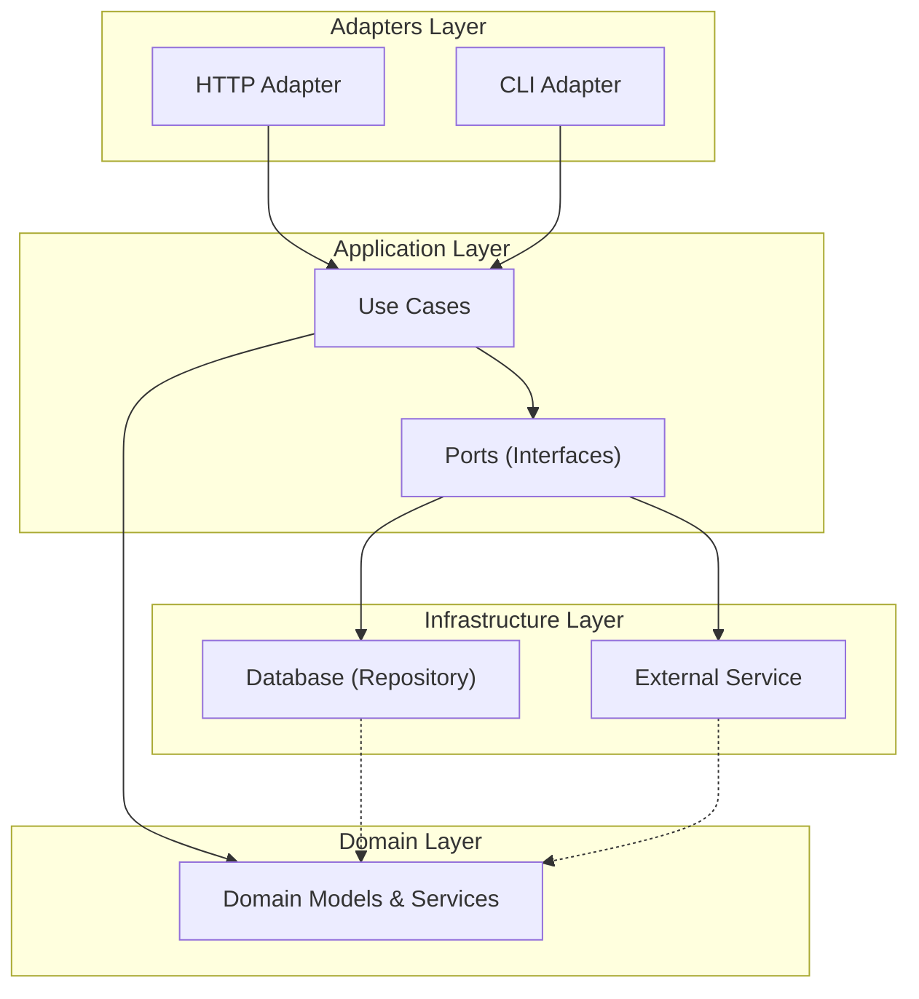

## Naming Conventions

- **Port**: Interface for inbound/outbound communication (e.g., `TodoUseCasePort`, `TodoRepositoryPort`).
- **UseCase**: Application service implementing a use case (e.g., `TodoUseCase`).
- **Adapter**: Inbound adapter (e.g., `TodoHTTPAdapter`, `TodoCLIAdapter`).
- **Model**: Application-layer models for request/response and error responses (formerly DTOs).
- **DomainErrorPort**: Interface for domain errors with getter methods.

## DDD Principles Applied

- **Encapsulation**: Domain models have private fields and public getters/setters.
- **Separation of Concerns**: Each layer has a clear responsibility.
- **Ports & Adapters**: All communication is via interfaces (ports), implemented by adapters.
- **No DTOs in Domain**: Domain layer only uses pure domain models; application models (formerly DTOs) are used in the application and adapter layers.

## Use Case Explanation

A **use case** is a specific business action or process your system must support (e.g., "Create Todo", "List Todos", "Complete Todo"). In this architecture:

- The **use case interface** (sometimes called a "port") is defined in the **application layer** (not the domain layer). This interface describes what actions the application can perform, but not how.
- The **use case implementation** is also in the **application layer**. This is the struct (e.g., `TodoUseCase`) that implements the interface and contains the orchestration logic. It coordinates domain models/services and infrastructure via interfaces.
- The **domain layer** does **not** define use case interfaces or implementations. The domain layer only contains business entities, value objects, and domain services (pure business logic).

**Why is it done this way?**
- **Separation of concerns:** The application layer is responsible for orchestrating business processes (use cases), while the domain layer is responsible for business rules and logic.
- **Testability and flexibility:** By defining interfaces (ports) in the application layer, you can easily swap implementations or mock them for testing.
- **No business process orchestration in the domain:** The domain layer should not know about application workflows or infrastructure.

**Example:**

*application/port/todo_usecase_port.go*
```go
// Use case interface (port)
type TodoUseCasePort interface {
    CreateTodoUseCase(cmd CreateTodoCommand) (TodoID, *DomainError)
    ListTodosUseCase() (TodoListResponse, *DomainError)
    // ... other use cases
}
```

*application/usecase/todo_usecase.go*
```go
// Use case implementation
type TodoUseCase struct {
    // dependencies (e.g., repository, domain service)
}

func (uc *TodoUseCase) CreateTodoUseCase(cmd CreateTodoCommand) (TodoID, *DomainError) {
    // Orchestrate domain logic, validation, persistence, etc.
}
```

**Summary Table:**

| Layer             | What's here?                                 | Why?                                 |
|-------------------|----------------------------------------------|--------------------------------------|
| Application Layer | Use case interfaces (ports) and implementations | Orchestrates business processes      |
| Domain Layer      | Entities, value objects, domain services     | Encapsulates business rules/logic    |

## Domain Service and Domain Model Explanation

- **Domain Model**: In this project, a 'model' means a Go `struct` that represents a business concept or entity (like `Todo`, `User`, or `Category`). It encapsulates both the data (fields) and the business logic (methods) for that concept. Models are not just data holders—they enforce business rules and behaviors.

  **If you realize a model is not yet defined as a business concept:**
  - Define it as a new domain model in `domain/model/`. For example, if you need a `Reminder` for todos and it doesn't exist, create a `Reminder` struct in `domain/model/`.
  - Add relevant fields and methods that represent the business rules for that concept.

  Example:
  ```go
  // domain/model/todo.go
  type Todo struct {
      id    TodoID
      title string
      // ... other fields ...
  }
  func (t *Todo) MarkAsCompleted() error { /* business logic */ }
  ```
  This ensures that business rules are always enforced and the model cannot be put into an invalid state from outside the domain layer.

- **Domain Service**: A domain service is used when business logic:
  - Spans multiple models/entities (e.g., validating a relationship between a `User` and a `Todo`).
  - Represents a process or operation that doesn't naturally belong to a single entity (e.g., complex validation, calculations, or coordination between models).
  - Is not about a 'thing' but about an 'action' or 'process' in the domain.

  **If, while developing a domain service, you realize you need a new struct:**
  - Define the new struct as a domain model in `domain/model/`.
  - Use this new model in your domain service as needed.
  - This is a normal part of iterative design: as you discover new business concepts, you model them explicitly.

  Example:
  ```go
  // domain/service/todo_domain_service.go
  type TodoDomainService struct {}
  func (s *TodoDomainService) ValidateTitle(title string) *DomainError { /* ... */ }
  // If you realize you need a new concept, e.g., Reminder:
  // domain/model/reminder.go
  type Reminder struct {
      time time.Time
      // ...
  }
  ```

**Summary:**
- Always model business concepts as domain models (structs with data and business logic).
- Use domain services for operations/processes that don't belong to a single model.
- If you discover a new concept while writing a service, create a new domain model for it.
- This approach keeps your domain layer expressive, flexible, and true to the business language.

## Visual Overview: How the Layers Fit Together



*Diagram: The Domain Layer is at the center. The Application Layer surrounds it and coordinates business processes. Adapters (like HTTP or CLI) let the outside world talk to your app, and Infrastructure (like databases or external services) handles technical details. Arrows show the direction of communication and dependencies.* 

## Glossary: Key Terms

- **Domain Layer**: The heart of your app. Where the real business rules and logic live.
- **Application Layer**: The orchestrator. Coordinates business processes and tells the domain what to do.
- **Adapters Layer**: The translator. Lets the outside world (users, web, CLI) talk to your app.
- **Infrastructure Layer**: The toolbox/plumbing. Handles technical details like databases and external services.
- **Use Case**: A specific business action or process (like "Create Todo").
- **Port**: An interface that defines what your app can do or what it needs from the outside world.
- **Adapter**: Code that connects your app to the outside world (like HTTP or CLI) or to infrastructure (like a database).
- **Repository**: A special adapter that handles saving and loading data (usually from a database).
- **Repository Pattern**: A design pattern for abstracting data storage, so your code works the same way no matter where data is stored.
- **Domain Model**: A Go struct that represents a business concept (like a Todo or User), with its own rules and logic.
- **Entity**: A domain model with a unique identity (like a Todo with an ID).
- **Value Object**: A small object that represents a value and has no unique identity (like a date or money amount).
- **Aggregate**: A cluster of domain objects (entities and value objects) treated as a single unit for data changes (e.g., an Order with OrderItems).
- **DTO (Data Transfer Object)**: A simple struct used to move data between layers or over the network (like API requests/responses).
- **Command**: An object that represents an action to perform (like "CreateTodoCommand").
- **Query**: An object that represents a request for information (like "ListTodosQuery").
- **Service**: Logic that doesn't fit in a single model. A **domain service** contains business rules; an **application service** coordinates use cases.
- **Event**: Something that happened in the system (like "TodoCompletedEvent").
- **Factory**: Code that helps create complex objects (like a function to create a new Todo with all rules enforced).
- **Persistence Model**: A struct used to represent data as it is stored in a database (like `TodoRecord`).
- **API Model**: A struct used to represent data as it is sent to or from an API (like `TodoResponse`).
- **Mapper**: A function or method that converts data from one model to another (like from a domain model to a DTO).
- **Anti-Corruption Layer (ACL)**: A protective barrier that translates between your clean domain and messy or different external systems, so your business logic stays clean.

## Step-by-Step Example: Creating a Todo

Let's see how all the layers work together when someone creates a new Todo using the HTTP API:

1. **User sends a request** (Adapters Layer)
   - The user (or their app) sends a POST request to the HTTP API to create a new Todo.
2. **HTTP Adapter receives the request** (Adapters Layer)
   - The HTTP Adapter reads the request and turns it into a command the app understands.
3. **Application Layer handles the command** (Application Layer)
   - The Application Layer (the orchestrator) takes the command and starts the "Create Todo" use case.
4. **Business rules are checked** (Domain Layer)
   - The Application Layer asks the Domain Layer (the heart) to create a new Todo, making sure all business rules are followed (like title can't be empty).
5. **Todo is saved** (Infrastructure Layer)
   - The Application Layer uses a Port (interface) to ask the Infrastructure Layer (the toolbox) to save the new Todo in the database (using a Repository).
6. **Response goes back to the user** (Adapters Layer)
   - The Application Layer sends the result back to the HTTP Adapter, which turns it into a response the user can understand (like a success message or error).

*This flow shows how each layer has a clear job, and how they work together to keep your business logic clean and protected from technical details.* 

## Layer Dependencies and the Role of ACL

In this architecture, each layer has clear rules about what it can depend on. This helps keep your code clean, flexible, and easy to change.

| Layer              | Depends On                | Depended On By         | Notes |
|--------------------|--------------------------|------------------------|-------|
| **Domain**         | (none)                    | Application            | The core. No dependencies on other layers. |
| **Application**    | Domain (calls), Ports (interfaces) | Adapters, Infrastructure | Orchestrates business logic, depends on domain and interfaces (ports). |
| **Adapters**       | Application (ports/interfaces)     | (none, or external users) | Talks to the outside world, depends on application layer interfaces. |
| **Infrastructure** | Application (ports/interfaces), external systems | (none) | Implements technical details, depends on application interfaces and external services. |

**Dependency Direction:**
- The arrows in the diagram (see above) show that dependencies always point **inward** toward the Domain Layer. The Domain Layer never depends on anything else.
- The Application Layer depends on the Domain Layer and on interfaces (ports), but not on adapters or infrastructure details.
- Adapters and Infrastructure depend on the Application Layer (by implementing its interfaces/ports).

**Where does the ACL fit in?**
- The **Anti-Corruption Layer (ACL)** is usually part of the Infrastructure Layer.
- When your system needs to talk to an external or legacy system (with different models or rules), the ACL acts as a translator or shield.
- The ACL depends on the external system and on your application's ports/interfaces, but your Domain and Application Layers never depend directly on the external system.

*This structure keeps your business logic safe from changes or "corruption" by outside systems, and makes your codebase easier to test and evolve.* 

## Mapping Between Layers

In DDD and Hexagonal Architecture, **mapping** is how we convert data between layers to keep business logic clean and technical details separate. Each layer has its own models, and we use mapping functions to translate between them.

| Layer            | Maps From                | Maps To                  | What it Receives         | What it Returns           | Purpose/Example |
|------------------|-------------------------|--------------------------|--------------------------|---------------------------|-----------------|
| Application      | Domain Model            | Application Model (DTO)  | `*Todo` (domain)         | `*TodoResponse` (DTO)     | Prepares data for API/adapter responses<br>e.g., `ToTodoResponse(todo *Todo) *TodoResponse` |
| Adapters         | Application Model (DTO) | External Format (JSON, CLI args) | `*TodoResponse` (DTO)   | JSON, CLI output          | Converts app data to/from external formats<br>e.g., JSON marshalling/unmarshalling |
| Infrastructure   | Domain Model            | Persistence Model (DB record) | `*Todo` (domain)        | `*TodoRecord` (DB struct) | Prepares data for storage/retrieval<br>e.g., `ToTodoRecord(todo *Todo) *TodoRecord` |
| ACL              | Domain/App Model        | External System Model     | `*Payment` (domain/app)  | `*ExternalPayment`        | Translates between your models and external/legacy system models |

**How does mapping work?**
- **Application Layer:**
  - Receives: Domain model (e.g., `*Todo`)
  - Returns: Application model/DTO (e.g., `*TodoResponse`)
  - Example: `ToTodoResponse(todo *Todo) *TodoResponse`
- **Adapters Layer:**
  - Receives: Application model/DTO (e.g., `*TodoResponse`)
  - Returns: External format (e.g., JSON, CLI output)
  - Example: JSON marshalling/unmarshalling
- **Infrastructure Layer:**
  - Receives: Domain model (e.g., `*Todo`)
  - Returns: Persistence model (e.g., `*TodoRecord` for DB)
  - Example: `ToTodoRecord(todo *Todo) *TodoRecord`
- **ACL:**
  - Receives: Your domain or application model (e.g., `*Payment`)
  - Returns: External system model (e.g., `*ExternalPayment`)
  - Example: `ToExternalPayment(payment *Payment) *ExternalPayment`

**Example mapping functions:**
```go
// Application Layer: Domain -> DTO
func ToTodoResponse(todo *Todo) *TodoResponse { /* ... */ }

// Infrastructure Layer: Domain -> DB record
func ToTodoRecord(todo *Todo) *TodoRecord { /* ... */ }

// ACL: Domain/App -> External system
func ToExternalPayment(payment *Payment) *ExternalPayment { /* ... */ }
```

*Mapping functions help data flow safely and clearly between layers, so each layer can focus on its own job.* 